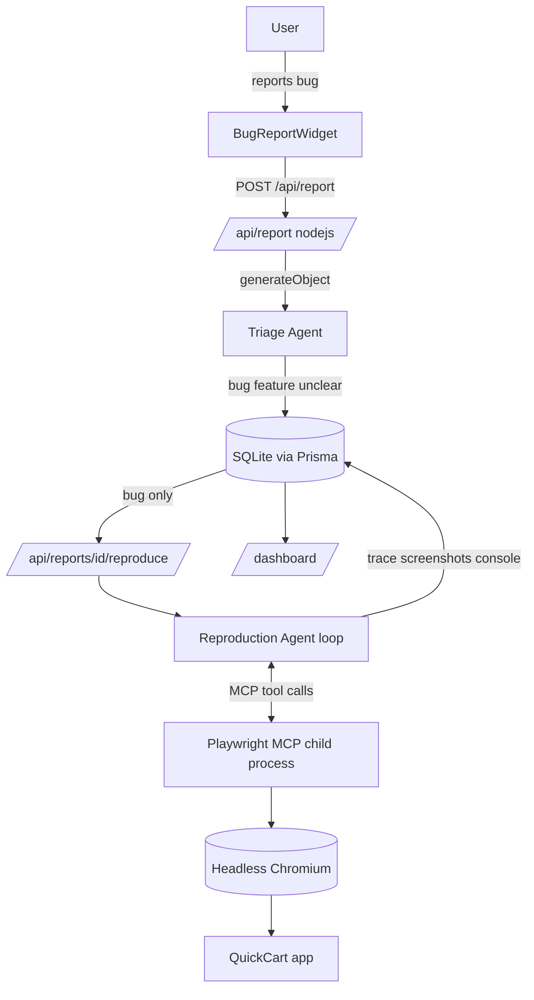

# Automated Issue Reproduction System — Overview

Opinionated, milestone-based build. Each milestone is independently demoable. Stack is fixed: **Next.js App Router + TypeScript**, **Vercel AI SDK**, **Playwright MCP** (stdio), **in-app dashboard** as the only results sink.

Read the milestones in order:

1. [01-m0-dummy-app-and-widget.plan.md](01-m0-dummy-app-and-widget.plan.md) — dummy app with seeded bugs + report widget (no AI)
2. [02-m1-triage-agent.plan.md](02-m1-triage-agent.plan.md) — LLM triage + dashboard v1
3. [03-m2-reproduction-agent.plan.md](03-m2-reproduction-agent.plan.md) — Playwright MCP reproduction agent (happy path)
4. [04-m3-robustness-and-polish.plan.md](04-m3-robustness-and-polish.plan.md) — robustness, evidence, ticket filing, polish

## Locked technical decisions

- **LLM layer**: Vercel AI SDK. Triage uses `generateObject` (structured output via Zod). Reproduction uses `generateText` with a multi-step tool loop (`stopWhen: stepCountIs(...)`).
- **Browser layer**: Playwright MCP spawned locally as a stdio child process via `npx @playwright/mcp@latest --headless --output-dir ...`, wired in with `experimental_createMCPClient` + `Experimental_StdioMCPTransport`. The model calls MCP tools directly (`browser_navigate`, `browser_snapshot`, `browser_click`, `browser_type`, `browser_fill_form`, `browser_take_screenshot`, `browser_console_messages`, `browser_network_requests`, `browser_wait_for`, `browser_close`).
- **Runtime constraint**: MCP stdio spawns a child process, so every AI route must use `export const runtime = 'nodejs'` (never edge). Reproduction is long-running, so it runs as an async task that writes status to the DB; the dashboard polls.
- **Storage**: SQLite via Prisma (one `Report` model that accretes columns across milestones). Simple, durable, zero external setup.
- **App identity**: `QuickCart` — a mini e-commerce storefront → cart → checkout. Checkout is where the seeded bugs live.

## Target architecture (end state)

## App structure (end state)

- `app/page.tsx` — storefront (product grid)
- `app/cart/page.tsx` — cart
- `app/checkout/page.tsx` — checkout form (holds all 3 seeded bugs)
- `app/dashboard/page.tsx` — triage + reproduction results
- `app/api/report/route.ts` — receive report, run triage
- `app/api/reports/route.ts` — list reports (dashboard data)
- `app/api/reports/[id]/route.ts` — get detail / submit follow-up answer (Unclear loop)
- `app/api/reports/[id]/reproduce/route.ts` — kick off reproduction (async)
- `components/BugReportWidget.tsx` — floating button + modal
- `lib/db.ts` (Prisma client), `lib/triage.ts`, `lib/reproduce.ts`, `lib/appContext.ts` (route map / app description shared by both agents)

## The seeded bugs (in `app/checkout/page.tsx`)

1. **Form-input failure** — Discount field: applying coupon `SAVE10` and then editing quantity recomputes total as `NaN` (discount subtracted before re-parsing quantity string). Triggers on a specific input path.
2. **Sequence-dependent button break** — Apply coupon → remove an item → apply coupon again throws (`coupon.applyTo(undefined)`), leaving "Place order" permanently disabled. Only breaks in that exact order.
3. **Race condition on submit** — "Place order" has no in-flight lock; double-click within ~300ms fires two POSTs → duplicate order. Reproducible by rapid double-click.

## The feature requests (for triage demo, not bugs)

- "Add a dark mode toggle."
- "Let me save my card / pay with PayPal."

## Results surface (in-app only)

- `/dashboard` lists every report with: triage badge (class + severity), repro status pill, a step-by-step trace timeline, screenshot thumbnails, captured console errors, and the final `record_outcome` verdict.
- "Filing a ticket" = creating a `Ticket`-flavored record (status `filed`) rendered as a card on success; failures render the failure-analysis narrative + escalation badge.

## Key technical risks (overall)

- **Long-running serverless route** killed mid-reproduction → run async + poll; set `maxDuration`; never use edge runtime.
- **MCP child-process lifecycle** (zombie browsers) → always `mcp.close()` in `finally`; one fresh session per run; unique `--output-dir` per report.
- **Agent loops / runaway cost** → hard `stepCountIs` cap + model `maxSteps`; cheap model for triage, stronger model for reproduction.
- **Snapshot size** → large accessibility trees can blow context; instruct depth-limited snapshots and target subtrees.
- **Bug determinism** — the race-condition bug is the riskiest to reproduce reliably via an agent; keep a deterministic fallback trigger (e.g. a hidden `?fast=1` that shortens the debounce) so the demo never flakes.

## Time estimate (2-person hackathon)

- M0 scaffold + dummy app + widget: ~3h
- M1 triage agent + dashboard v1: ~2.5h
- M2 reproduction agent happy path: ~3.5h
- M3 robustness, evidence, ticket filing, polish/Docker: ~3h
- **Total: ~12h** (one long day or two short sessions). Stop after any milestone and still demo.
